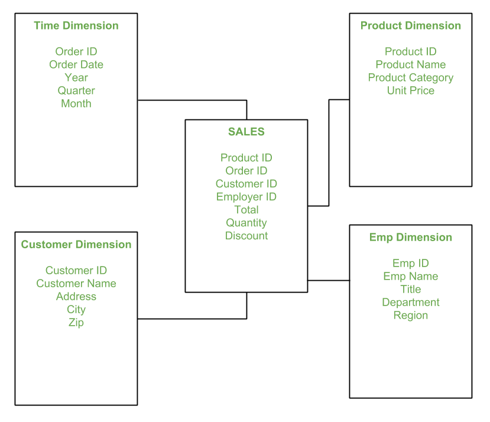

# 📘 Power BI Interview Master Document

**Structured Q\&A Format | Real-World Readiness | Updated 2025**

---

## 🔹 POWER BI ESSENTIALS

### 1. **What is Power BI?**

A Microsoft business intelligence tool to connect, transform, model, and visualize data using reports and dashboards.

### 2. **What are the main components?**

* **Power BI Desktop** – Build reports and models
* **Power BI Service** – Publish, share, and schedule refreshes
* **Power BI Gateway** – Connect cloud to on-premises data
* **Power BI Mobile** – View reports on mobile
* **Power BI Report Builder** – Create paginated reports
* **Deployment Pipelines** – Dev → Test → Prod promotion

---

## 🔹 DATA PREPARATION & POWER QUERY

### 3. **What is Power Query?**

A data transformation engine (using M language) for cleaning, filtering, reshaping, and combining data before modeling.

### 4. **How do you check data quality in Power BI?**

* Remove nulls or duplicates in Power Query
* Profile columns (check distinct values, missing rows)
* Use Power Query tools: “Column distribution,” “Column quality,” “Column profile”

---

## 🔹 MODELING & DATABASE BASICS

### 5. **What is data modeling?**

Defining how tables relate. It includes building relationships, applying business logic, and optimizing for analysis.

### 6. **What’s a Star Schema?**

A central **fact table** (e.g., Sales) linked to surrounding **dimension tables** (e.g., Date, Customer, Product).

> ✅ *Preferred in BI for simplicity, performance, and better DAX context.*

### 7. **Normalization vs. Denormalization**

* **Normalization**: Breaks data into logical, smaller tables to reduce redundancy.
* **Denormalization**: Combines tables for faster reads (used in BI tools).

### 8. **What are Primary and Foreign Keys?**

* **Primary Key**: Uniquely identifies a record in a table (e.g., CustomerID in Customer table).
* **Foreign Key**: Refers to a primary key in another table (e.g., CustomerID in Orders table).

---

## 🔹 ETL & DATA INTEGRATION

### 9. **What is ETL?**

Extract, Transform, Load:

* **Extract**: Connect to data sources
* **Transform**: Clean/shape data via Power Query
* **Load**: Bring into Power BI data model

### 10. **What is Incremental Refresh?**

Refreshes only new/changed data. Great for large datasets.

---

## 🔹 DAX & CALCULATIONS

### 11. **Difference: Measure vs. Calculated Column**

| Measure                       | Calculated Column              |
| ----------------------------- | ------------------------------ |
| Calculated on-the-fly         | Computed per row and stored    |
| Context-sensitive             | Row-specific                   |
| Used in visuals               | Used for filtering/slicing     |
| Example: `SUM(Sales[Amount])` | Example: `Sales[Amount] * 0.1` |

### 12. **SUM() vs. SUMX()**

* **SUM()**: Adds up a column directly
  → `SUM(Sales[Revenue])`
* **SUMX()**: Row-by-row expression
  → `SUMX(Sales, Sales[Qty] * Sales[Price])`

---

## 🔹 DAX CONTEXT & LOGIC

### 13. **Row Context vs. Filter Context**

* **Row Context**: One row at a time (used in calculated columns, iterators like SUMX)
* **Filter Context**: Comes from visuals/slicers (used in measures)

### 14. **What does CALCULATE() do?**

Changes the filter context of a calculation
→ `CALCULATE(SUM(Sales[Amount]), Region = "East")`

---

## 🔹 VISUALIZATION & UX DESIGN

### 15. **What are best practices for visuals?**

* Keep to 5–7 visuals per page
* Use slicers for interactivity
* Use tooltips, bookmarks, and dynamic titles
* Separate KPI cards, time trends, and drill-downs

### 16. **What are custom visuals and themes?**

* **Custom visuals**: Import from AppSource (e.g., Sankey, Word Cloud)
* **Themes**: `.json` files defining font, color, and layout styles

---

## 🔹 DEPLOYMENT & SHARING

### 17. **How do you publish a Power BI report?**

* Click **Publish** in Desktop
* Choose a workspace in Power BI Service

### 18. **What is a deployment pipeline?**

Dev → Test → Prod flow in Power BI Service to manage version control, testing, and production rollouts.

### 19. **How do you handle scheduled refreshes?**

* Power BI Service → Dataset → “Schedule Refresh”
* Set frequency and credentials
* Use **Gateways** for on-prem sources

---

## 🔹 PERFORMANCE OPTIMIZATION

### 20. **Performance Best Practices**

* Use star schema
* Remove unused columns
* Replace calculated columns with measures
* Turn off auto date/time
* Avoid heavy DAX in visuals
* Use Performance Analyzer & DAX Studio

---

## 🔹 ADVANCED FEATURES

### 21. **What is Row-Level Security (RLS)?**

Restricts data based on user roles.

* **Static**: Fixed filters (e.g., Region = East)
* **Dynamic**: Based on login using `USERPRINCIPALNAME()`

---

## 🔹 BONUS: Quick Concept Flashcards

| Concept               | One-Liner                        |
| --------------------- | -------------------------------- |
| DAX                   | Formula language for measures    |
| Power Query           | M-based engine for data prep     |
| Star Schema           | Fact + Dimensions (1-to-many)    |
| RLS                   | User-specific data views         |
| Slicer                | Visual filter                    |
| Incremental Refresh   | Refresh only changed data        |
| SUMX                  | Row-wise aggregation             |
| Deployment Pipeline   | Move content across environments |
| DirectQuery vs Import | Real-time vs In-memory           |
| SUM vs SUMX           | Aggregate column vs expression   |

---
